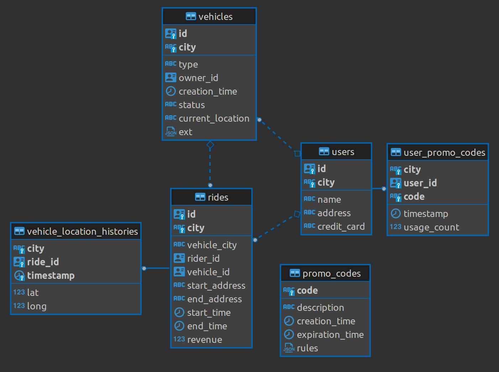

# Example Ent + CRDB

An example usage of [Ent](https://github.com/ent/ent) with [CockroachDB](https://github.com/cockroachdb/cockroach).

This server partially recreates the [Movr demo dataset](https://www.cockroachlabs.com/docs/stable/movr.html).



## Setup

Get [Golang](https://go.dev/dl/) and [Just](https://github.com/casey/just/releases) in your PATH:

```sh
go version
# 1.19.5

just --version
# 1.11.0
```

You also need [CRDB](https://www.cockroachlabs.com/docs/releases/index.html) on SQL port 26257, user root, no password, no TLS.<br/>
One way to do that is:

```sh
# Clean slate
rm -rf cdb-data
mkdir cdb-data

# Host networking, local state, no TLS
podman run -it --rm --net=host -v "${PWD}/cdb-data:/cockroach/cockroach-data" cockroachdb/cockroach:v22.2.3 start-single-node --insecure
```

## Usage

```sh
just run
```

Binds to port 9000.

Check the `justfile` for other options.
